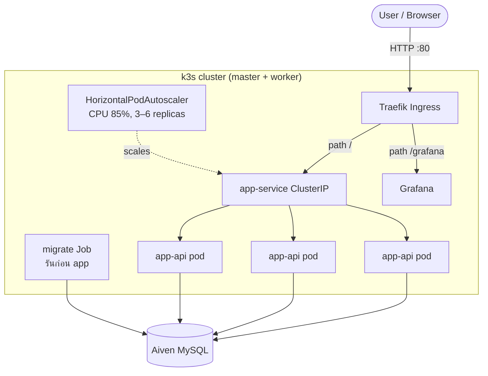
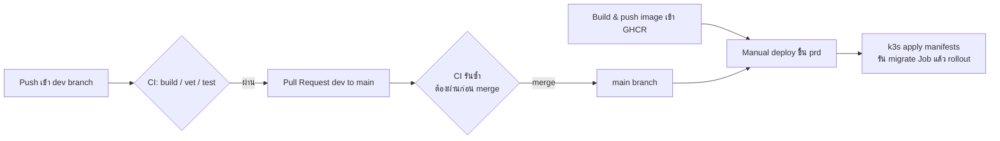
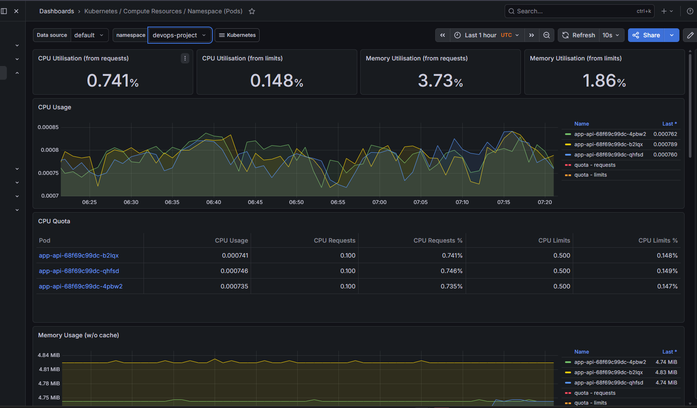

# DevOps Mini Project — Go API บน Kubernetes ที่ดูแลเอง

> โปรเจค DevOps แบบ end-to-end: นำ Go REST API มา containerize แล้ว deploy ขึ้น
> **k3s** Kubernetes cluster ที่ตั้งและดูแลเอง รองรับหลาย environment พร้อม
> **CI/CD pipeline** ครบวงจร, **monitoring**, **autoscaling** และ flow การเลื่อน
> โค้ดจาก **dev → production**


---

## ภาพรวม (Overview)

โปรเจคนี้สาธิต workflow การ deploy ที่ใกล้เคียงงานจริง สำหรับ web service ขนาดเล็ก —
ตั้งแต่ source code จนถึงแอปที่รันอยู่จริง มี monitoring และ auto-scale บน
infrastructure จริง (ไม่ใช่แค่ demo บนเครื่อง local)

Container image ตัวเดียวกันถูกใช้รัน 2 บทบาท โดยเลือกตอน runtime ผ่าน environment
variable:

- **`server`** — เปิดให้บริการ HTTP API
- **`migrator`** — รัน database migration ครั้งเดียวแล้วจบ (Kubernetes `Job`)

แยกออกเป็น 2 environment ที่อิสระจากกัน:

| Environment | Infrastructure | Database |
|---|---|---|
| **dev** | k3s บน VirtualBox VM (local) | Aiven MySQL (database `*_dev`) |
| **prd** | k3s บน VPS 2 เครื่อง (control-plane 1 + worker 1) | Aiven MySQL (database production) |

---

## สถาปัตยกรรม (Architecture)

### Runtime architecture (production)



### CI/CD pipeline



---

## Tech Stack

| ส่วน | เครื่องมือ |
|---|---|
| **Language / Framework** | Go 1.25, Fiber v3, GORM |
| **Containerization** | Docker (multi-stage build), GitHub Container Registry (GHCR) |
| **Orchestration** | Kubernetes (k3s), Traefik Ingress, Helm |
| **CI/CD** | GitHub Actions, self-hosted runners |
| **Monitoring** | Prometheus, Grafana (kube-prometheus-stack) |
| **Load testing** | k6 |
| **Database** | MySQL (Aiven) |
| **Infrastructure** | VPS (production), VirtualBox (development) |

---

## ฟีเจอร์เด่น (Key Features)

- **Multi-stage Docker build** ที่ฝัง build metadata (version, build time, commit
  SHA) ลงใน binary ผ่าน `-ldflags` แล้วแสดงผลที่ endpoint `/about`
- **Database migration เป็น Kubernetes Job** ที่รันจนเสร็จก่อนจะ rollout แอป โดยใช้
  image ตัวเดียวกันในโหมด `migrator`
- **แยก health probes ชัดเจน**:
  - `/livez` (liveness) — เช็คแค่ว่า process ยังทำงาน **ไม่แตะ DB** เพื่อไม่ให้
    DB หลุดชั่วคราวทำให้ pod ถูก restart โดยไม่จำเป็น
  - `/readyz` (readiness) — เช็ค database ด้วย เพื่อส่ง traffic เข้าเฉพาะ pod ที่
    พร้อมให้บริการจริง
- **Horizontal Pod Autoscaler** — scale `app-api` จาก 3 ถึง 6 replicas ที่ CPU
  85% (ทดสอบด้วย k6)
- **การแยก config ตาม environment** — secret แยกผ่าน GitHub Environments และ
  ConfigMap แยกไฟล์ (`configmap-dev.yaml` / `configmap-prd.yaml`)
- **Monitoring stack** — Prometheus + Grafana ติดตั้งผ่าน Helm เปิดที่ `/grafana`

---

## CI/CD และ Branching Strategy

โปรเจคใช้ flow **dev → main** พร้อม branch protection:

1. งานทั้งหมดทำบน branch **`dev`**
2. ทุกครั้งที่ push/PR **CI workflow** จะรันอัตโนมัติ:
   ตรวจ `go mod tidy` → `go vet` → `go build` → `go test`
3. **Pull Request** จาก `dev` เข้า `main` ต้องให้ CI ผ่านก่อนถึง merge ได้
   (บังคับด้วย branch ruleset บน `main`)
4. หลัง merge จะ **build แล้ว push image เข้า GHCR** แล้วค่อย **deploy ขึ้น
   production แบบ manual** (คุมจังหวะการ release เอง)

| Workflow | Trigger | หน้าที่ |
|---|---|---|
| `ci.yaml` | push / PR | build, vet, test โค้ด Go อัตโนมัติ |
| `workflow.yaml` | manual | build image แล้ว push เข้า GHCR (Docker Buildx) |
| `workflow-deploy.yaml` | manual | deploy ขึ้น dev หรือ prd (self-hosted runner + `kubectl`) |

> การ deploy ขึ้น production ตั้งใจให้เป็น **manual** เพื่อคุมจังหวะการ release ส่วน
> CI gate ทำหน้าที่ปกป้อง branch `main`

---

## โครงสร้างโปรเจค (Repository Structure)

```
.
├── cmd/                 # Entrypoint ของแอป (โหมด server / migrator)
├── di/                  # Dependency injection: config, database, server
├── service/             # HTTP handlers (user CRUD, status, health)
├── repository/          # Data access layer (GORM)
├── entity/              # Domain models
├── util/                # Build info, helpers
├── k8s/                 # Kubernetes manifests
│   ├── namespace.yaml
│   ├── configmap-dev.yaml / configmap-prd.yaml
│   ├── app.yaml         # Deployment + Service
│   ├── job.yaml         # DB migration Job
│   ├── hpa.yaml         # HorizontalPodAutoscaler
│   └── ingress.yaml     # Traefik Ingress (app + grafana)
├── .github/workflows/   # CI, build, deploy pipelines
└── Dockerfile           # Multi-stage build
```

---

## API Endpoints

| Method | Path | คำอธิบาย |
|---|---|---|
| `GET` | `/` | ภาพรวมสถานะ runtime |
| `GET` | `/about` | ข้อมูล service (version, build time, commit) |
| `GET` | `/livez` | Liveness probe (เช็คแค่ process) |
| `GET` | `/readyz` | Readiness probe (เช็ค DB) |
| `GET` | `/user` | ดูรายชื่อ user ทั้งหมด |
| `POST` | `/user` | สร้าง user |
| `DELETE` | `/user` | ลบ user |

---

## Monitoring และ Autoscaling

- **Grafana dashboards** (จาก kube-prometheus-stack) ติดตาม CPU/memory ราย pod,
  ราย namespace และราย node
- **Load testing ด้วย k6** ยิง traffic เข้า API เพื่อยืนยันว่า HPA scale replicas
  ขึ้นเมื่อ CPU สูงต่อเนื่อง และ scale ลงหลังพ้น stabilization window




---

## ปัญหาที่เจอและวิธีแก้ (Challenges & Solutions)

ตัวอย่างปัญหาจริงที่แก้ระหว่างทำโปรเจค:

- **`unknown blob` ตอน push เข้า GHCR** — เปลี่ยน build step จาก `docker push` CLI
  แบบเดิม มาเป็น **Docker Buildx (`build-push-action`)** ซึ่งแก้ปัญหา layer-mount
  ที่ fail แบบไม่สม่ำเสมอได้
- **DNS resolution ใน cluster ล้มเหลว** — migration Job แปลชื่อ hostname ของ
  database ภายนอกไม่ได้ วิเคราะห์พฤติกรรมการ forward DNS ภายนอกของ CoreDNS
- **Worker node join ไม่ได้ (`Node password rejected`)** — เกิดจาก node-password
  ค้างไม่ตรงกัน แก้โดยล้าง credential **ทั้ง 2 ฝั่ง** ทั้งที่ server (secret) และ
  agent (`/etc/rancher/node/password`)
- **`Connection refused` กับ `timed out`** — ใช้ความต่างนี้วิเคราะห์ว่า kubelet
  ไม่ได้ listen (ไม่ใช่ปัญหา firewall) เมื่อ pod บน node นั้นค้าง
- **การออกแบบ liveness/readiness** — แยก probe เพื่อให้ DB หลุดชั่วคราวกระทบแค่
  readiness (หยุดรับ traffic) แทนที่จะ kill pod ที่ยังดีอยู่

---

## สิ่งที่จะพัฒนาต่อ (Future Improvements)

- [ ] **HTTPS/TLS** ด้วย cert-manager + Let's Encrypt และ custom domain
- [ ] **Unit tests** สำหรับ handlers และ validation logic
- [ ] **Infrastructure as Code** (Ansible/Terraform) สำหรับ provision cluster
- [ ] **สแกนช่องโหว่ของ image** (Trivy) ใน CI
- [ ] **Application-level metrics** เปิดที่ `/metrics` ให้ Prometheus เก็บ
- [ ] **Alerting** ผ่าน Alertmanager (Discord/Slack)

---

## ผู้จัดทำ (Author)
Name : Thanut Sukprasertsom
Email : thanutsukprasetsomm@hotmail.com
GitHub : https://github.com/thanutgit?tab=repositories