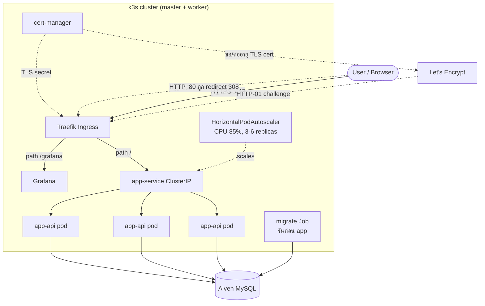
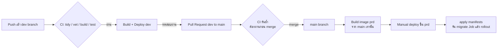

# DevOps Mini Project — Go API บน Kubernetes ที่ดูแลเอง

> โปรเจค DevOps แบบ end-to-end: นำ Go REST API มา containerize แล้ว deploy ขึ้น
> **k3s** Kubernetes cluster ที่ตั้งและดูแลเอง รองรับหลาย environment พร้อม
> **CI/CD pipeline**, **HTTPS อัตโนมัติ**, **monitoring**, **autoscaling** และ flow การเลื่อน
> โค้ดจาก **dev → production**


🔗 **Live:** https://45.150.128.180.nip.io

> ใช้ Aiven MySQL free tier ซึ่งจะปิดตัวเองเมื่อไม่มีการใช้งาน หากเข้าไม่ได้แปลว่า
> database อยู่ในสถานะพัก

---

## ภาพรวม (Overview)

โปรเจคนี้สาธิต workflow การ deploy ที่ใกล้เคียงงานจริง สำหรับ web service ขนาดเล็ก —
ตั้งแต่ source code จนถึงแอปที่รันอยู่จริงผ่าน HTTPS มี monitoring และ auto-scale บน
infrastructure จริง (ไม่ใช่แค่ demo บนเครื่อง local)

Container image ตัวเดียวกันถูกใช้รัน 2 บทบาท โดยเลือกตอน runtime ผ่าน environment
variable:

- **`server`** — เปิดให้บริการ HTTP API
- **`migrator`** — รัน database migration ครั้งเดียวแล้วจบ (Kubernetes `Job`)

แยกออกเป็น 2 environment ที่อิสระจากกัน:

| Environment | Infrastructure | Database | เข้าถึง |
|---|---|---|---|
| **dev** | k3s บน VirtualBox VM (local) | Aiven MySQL (database `*_dev`) | HTTP ผ่าน IP ของ VM |
| **prd** | k3s บน VPS 2 เครื่อง (control-plane 1 + worker 1) | Aiven MySQL (database production) | HTTPS ผ่าน `45.150.128.180.nip.io` |

> dev ไม่มี TLS เพราะอยู่ใน IP ภายใน Let's Encrypt ยิงเข้ามาตรวจ (HTTP-01) ไม่ถึง

---

## สถาปัตยกรรม (Architecture)

### Runtime architecture (production)


```mermaid
flowchart TD
    User([User / Browser]) -->|HTTPS :443| Traefik[Traefik Ingress]
    User -.->|HTTP :80 ถูก redirect 308| Traefik
    LE[Let's Encrypt] -.HTTP-01 challenge.-> Traefik
    CM[cert-manager] -.ขอ/ต่ออายุ TLS cert.-> LE
    CM -.TLS secret.-> Traefik
    Traefik -->|path /| Svc[app-service ClusterIP]
    Traefik -->|path /grafana| Graf[Grafana]
    Svc --> P1[app-api pod]
    Svc --> P2[app-api pod]
    Svc --> P3[app-api pod]
    HPA[HorizontalPodAutoscaler<br/>CPU 85%, 3-6 replicas] -.scales.-> Svc
    P1 --> DB[(Aiven MySQL)]
    P2 --> DB
    P3 --> DB
    Job[migrate Job<br/>รันก่อน app] --> DB

    subgraph Cluster["k3s cluster (master + worker)"]
        Traefik
        CM
        Svc
        P1
        P2
        P3
        HPA
        Job
        Graf
    end
```

### CI/CD pipeline


```mermaid
flowchart LR
    Dev[Push เข้า dev branch] --> CI{CI: tidy / vet / build / test}
    CI -->|ผ่าน| DevDeploy[Build + Deploy dev]
    DevDeploy -->|ทดสอบผ่าน| PR[Pull Request dev to main]
    PR --> CI2{CI รันซ้ำ<br/>ต้องผ่านก่อน merge}
    CI2 -->|merge| Main[main branch]
    Main --> Build[Build image prd<br/>จาก main เท่านั้น]
    Build --> Deploy[Manual deploy ขึ้น prd]
    Deploy --> K8s[apply manifests<br/>รัน migrate Job แล้ว rollout]
```

---

## Tech Stack

| ส่วน | เครื่องมือ |
|---|---|
| **Language / Framework** | Go 1.25, Fiber v3, GORM |
| **Containerization** | Docker (multi-stage build บน alpine), GitHub Container Registry (GHCR) |
| **Orchestration** | Kubernetes (k3s), Traefik Ingress, Helm |
| **TLS** | cert-manager, Let's Encrypt (HTTP-01) |
| **CI/CD** | GitHub Actions, self-hosted runners, GitHub Environments |
| **Monitoring** | Prometheus, Grafana (kube-prometheus-stack) |
| **Testing** | Go testing (table-driven unit tests), k6 (load testing) |
| **Database** | MySQL (Aiven) |
| **Infrastructure** | VPS (production), VirtualBox (development) |

---

## ฟีเจอร์เด่น (Key Features)

- **Multi-stage Docker build** — แยก stage build ออกจาก runtime ทำให้ image เล็กลงมาก
  และฝัง build metadata (version, build time, commit SHA) ลงใน binary ผ่าน `-ldflags`
  แสดงผลที่ endpoint `/about`
- **Database migration เป็น Kubernetes Job** ที่รันจนเสร็จก่อนจะ rollout แอป โดยใช้
  image ตัวเดียวกันในโหมด `migrator`
- **แยก health probes ชัดเจน**:
  - `/livez` (liveness) — เช็คแค่ว่า process ยังทำงาน **ไม่แตะ DB** เพื่อไม่ให้
    DB หลุดชั่วคราวทำให้ pod ถูก restart โดยไม่จำเป็น
  - `/readyz` (readiness) — เช็ค database ด้วย เพื่อส่ง traffic เข้าเฉพาะ pod ที่
    พร้อมให้บริการจริง
- **HTTPS อัตโนมัติ** — cert-manager ขอและต่ออายุ certificate จาก Let's Encrypt
  ทดสอบกับ staging issuer ก่อนเปลี่ยนเป็น production เพื่อเลี่ยง rate limit
  และ redirect HTTP → HTTPS ทุก request ด้วย Traefik Middleware
- **Horizontal Pod Autoscaler** — scale `app-api` จาก 3 ถึง 6 replicas ที่ CPU
  85% (ทดสอบด้วย k6)
- **Unit tests แบบ table-driven** รันใน CI ก่อน merge ทุกครั้ง
- **การแยก config ตาม environment** — secret แยกผ่าน GitHub Environments,
  ConfigMap และ Ingress แยกไฟล์ต่อ environment
- **แยก platform กับ application** — ของที่ตั้งครั้งเดียวต่อ cluster (`k8s/platform/`)
  แยกจาก manifest ที่ deploy ทุก release
- **Monitoring stack** — Prometheus + Grafana ติดตั้งผ่าน Helm เปิดที่ `/grafana`

---

## CI/CD และ Branching Strategy

โปรเจคใช้ flow **dev → main** พร้อม branch protection:

1. งานทั้งหมดทำบน branch **`dev`**
2. ทุกครั้งที่ push/PR **CI workflow** จะรันอัตโนมัติ:
   ตรวจ `go mod tidy` → `go vet` → `go build` → `go test`
3. Build และ deploy ขึ้น **dev** เพื่อทดสอบบน cluster จริง
4. **Pull Request** จาก `dev` เข้า `main` ต้องให้ CI ผ่านก่อนถึง merge ได้
   (บังคับด้วย branch ruleset บน `main`)
5. Build image production **จาก branch `main` เท่านั้น** แล้ว **deploy ขึ้น
   production แบบ manual** (คุมจังหวะการ release เอง)

| Workflow | Trigger | หน้าที่ |
|---|---|---|
| `ci.yaml` | push / PR | tidy, vet, build, test โค้ด Go อัตโนมัติ |
| `workflow.yaml` | manual | build image แล้ว push เข้า GHCR (Docker Buildx) ใช้ tag แบบ calendar versioning |
| `workflow-deploy.yaml` | manual | deploy ขึ้น dev หรือ prd (self-hosted runner แยก label ต่อ environment) |

> ตอนนี้เป็น **Continuous Delivery** — pipeline พร้อม deploy ตลอด แต่ขั้นขึ้น
> production ตั้งใจให้เป็น manual เพื่อคุมจังหวะการ release ส่วน CI gate
> ทำหน้าที่ปกป้อง branch `main`

---

## โครงสร้างโปรเจค (Repository Structure)

```
.
├── cmd/                      # Entrypoint ของแอป (โหมด server / migrator)
├── di/                       # Dependency injection: config, database, server
├── service/                  # HTTP handlers (user CRUD, status, health) + unit tests
├── repository/               # Data access layer (GORM)
├── entity/                   # Domain models
├── util/                     # Build info, helpers + unit tests
├── k8s/
│   ├── platform/             # ตั้งครั้งเดียวต่อ cluster (ไม่ได้ deploy ทุก release)
│   │   ├── cluster-issuer.yaml       # Let's Encrypt staging + production
│   │   └── monitoring-values.yaml    # ค่าของ kube-prometheus-stack
│   ├── namespace.yaml
│   ├── configmap-dev.yaml / configmap-prd.yaml
│   ├── app.yaml              # Deployment + Service
│   ├── job.yaml              # DB migration Job
│   ├── hpa.yaml              # HorizontalPodAutoscaler
│   ├── ingress-dev.yaml      # HTTP
│   └── ingress-prd.yaml      # HTTPS + cert-manager + redirect middleware
├── .github/workflows/        # CI, build, deploy pipelines
└── Dockerfile                # Multi-stage build
```

---

## API Endpoints

| Method | Path | คำอธิบาย |
|---|---|---|
| `GET` | `/` | ภาพรวมสถานะ runtime |
| `GET` | `/about` | ข้อมูล service (version, build time, commit) |
| `GET` | `/livez` | Liveness probe (เช็คแค่ process) |
| `GET` | `/readyz` | Readiness probe (เช็ค DB) |
| `GET` | `/user` | ดูรายชื่อ user ทั้งหมด |
| `POST` | `/user` | สร้าง user |
| `DELETE` | `/user` | ลบ user |

---

## Monitoring และ Autoscaling

- **Grafana dashboards** (จาก kube-prometheus-stack) ติดตาม CPU/memory ราย pod,
  ราย namespace และราย node
- **Load testing ด้วย k6** ยิง traffic เข้า API เพื่อยืนยันว่า HPA scale replicas
  ขึ้นเมื่อ CPU สูงต่อเนื่อง และ scale ลงหลังพ้น stabilization window

<!-- ย้ายไฟล์ image.png เดิมมาไว้ที่ docs/ แล้วตั้งชื่อให้ตรงกับด้านล่าง -->


---

## การตั้ง cluster ใหม่ (Platform Setup)

ขั้นตอนที่ทำครั้งเดียวต่อ cluster ก่อน deploy แอปผ่าน workflow ครั้งแรก:

1. ติดตั้ง k3s บน control-plane และ join worker (hostname ต้องไม่ซ้ำกัน)
2. ตรวจ netplan ของทุก node ว่าไม่มี search domain ที่ไม่จำเป็น
3. ติดตั้ง self-hosted runner บน node ที่มี kubeconfig และตั้ง label ตาม environment
4. ติดตั้ง monitoring:
   `helm upgrade --install monitoring prometheus-community/kube-prometheus-stack -n monitoring --create-namespace -f k8s/platform/monitoring-values.yaml`
5. ติดตั้ง cert-manager (เฉพาะ prd):
   `helm install cert-manager jetstack/cert-manager -n cert-manager --create-namespace --set crds.enabled=true`
6. `kubectl apply -f k8s/platform/cluster-issuer.yaml`
7. เปิด port 80 และ 443 ทั้งที่ firewall ของ OS และของผู้ให้บริการ VPS

---

## ปัญหาที่เจอและวิธีแก้ (Challenges & Solutions)

ตัวอย่างปัญหาจริงที่แก้ระหว่างทำโปรเจค:

- **Search domain + `ndots:5` ทำให้ต่อ database ผิดที่** — migration Job timeout
  ทั้งที่ `dig` จาก host ได้ IP ถูกต้อง ใช้ `getent` ใน pod (ซึ่งใช้ search list
  เหมือนแอป) พบว่า node มี search domain `com` จาก netplan ของผู้ให้บริการ VPS
  ทำให้ชื่อถูกขยายเป็น `*.aivencloud.com.com` แล้วไปชน wildcard DNS ของ domain อื่น
  แก้ที่ node และตั้ง `dnsConfig.ndots` ใน pod spec เป็นชั้นป้องกันเพิ่ม
- **Panic จาก `time.LoadLocation` หลังเปลี่ยน image เป็น alpine** — alpine ไม่มี
  tzdata และโค้ดทิ้ง error ไว้ ทำให้ pod ตายเมื่อมีคนเปิดหน้าแรก แต่ probe ยังผ่าน
  unit test ไม่จับเพราะ CI runner มี tzdata แก้โดยฝัง `time/tzdata` ลงใน binary
  และเพิ่ม fallback เมื่อโหลด timezone ไม่ได้
- **`Connection refused` กับ `timed out`** — ใช้ความต่างนี้วิเคราะห์ว่า kubelet
  ไม่ได้ listen (ไม่ใช่ปัญหา firewall) เมื่อ pod บน worker ค้าง
- **Worker node join ไม่ได้ (`Node password rejected`)** — เกิดจาก hostname ซ้ำและ
  node-password ไม่ตรงกัน แก้โดยล้าง credential **ทั้ง 2 ฝั่ง** ทั้งที่ server
  (secret) และ agent (`/etc/rancher/node/password`)
- **`kubectl apply` ไม่ลบ resource เก่า** — ไฟล์ ingress ว่างทำให้ deploy fail
  แต่เว็บยังเข้าได้เพราะ ingress ตัวเดิมค้างอยู่ใน cluster (config drift) ตรวจผล
  ของ workflow แทนการดูแค่ว่าเว็บยังเข้าได้
- **Certificate ค้างสถานะ `processing`** — 2 certificate ขอ domain เดียวกันพร้อมกัน
  ตัวที่สองใช้ authorization ซ้ำแล้ว order ไม่เดินต่อ แก้โดยให้ cert-manager
  สร้าง request ใหม่
- **Redirect HTTP → HTTPS กับการต่ออายุ certificate** — HTTP-01 challenge
  ของ Let's Encrypt ใช้ port 80 และ redirect ครอบคลุม path `/.well-known/acme-challenge/`
  ด้วย จึงอาจทำให้ต่ออายุ cert ไม่ผ่าน แทนที่จะรอลุ้นตอน cert ใกล้หมดอายุ
  ทดสอบโดยสลับไป staging issuer เพื่อบังคับให้ออก cert ใหม่จริง ผลคือผ่านปกติ
  (Let's Encrypt ตาม redirect ได้) แล้วค่อยสลับกลับเป็น production
- **การออกแบบ liveness/readiness** — แยก probe เพื่อให้ DB หลุดชั่วคราวกระทบแค่
  readiness (หยุดรับ traffic) แทนที่จะ kill pod ที่ยังดีอยู่
- **Managed database ปิดตัวเอง** — Aiven free tier ปิด service เมื่อไม่มีการใช้งาน
  ทำให้ระบบที่เคยทำงานได้พังโดยไม่ได้แก้โค้ด ควรเช็คสถานะ dependency ก่อนไล่ network
- **`unknown blob` ตอน push เข้า GHCR** — เปลี่ยน build step จาก `docker push` CLI
  แบบเดิม มาเป็น **Docker Buildx (`build-push-action`)**

---

## สิ่งที่จะพัฒนาต่อ (Future Improvements)

- [ ] **Image promotion** — build ครั้งเดียวแล้ว promote image ตัวเดิม (digest เดียวกัน) ไป prd
- [ ] **Alert เมื่อ certificate ใกล้หมดอายุ** ผ่าน Prometheus/Alertmanager
- [ ] **Smoke test ใน CI** — รัน container จริงแล้วเรียก endpoint ก่อน deploy
- [ ] **Validate manifest ใน CI** (kubeconform)
- [ ] **Infrastructure as Code** (Ansible) สำหรับ provision cluster
- [ ] **สแกนช่องโหว่ของ image** (Trivy) ใน CI
- [ ] **Application-level metrics** เปิดที่ `/metrics` ให้ Prometheus เก็บ
- [ ] **Custom domain** แทน nip.io

---

## ผู้จัดทำ (Author)

- **Name:** Thanut Sukprasertsom
- **Email:** thanutsukprasertsomm@hotmail.com
- **GitHub:** https://github.com/thanutgit
- **LinkedIn:** https://www.linkedin.com/in/thanut-sukprasertsom-b77048386/