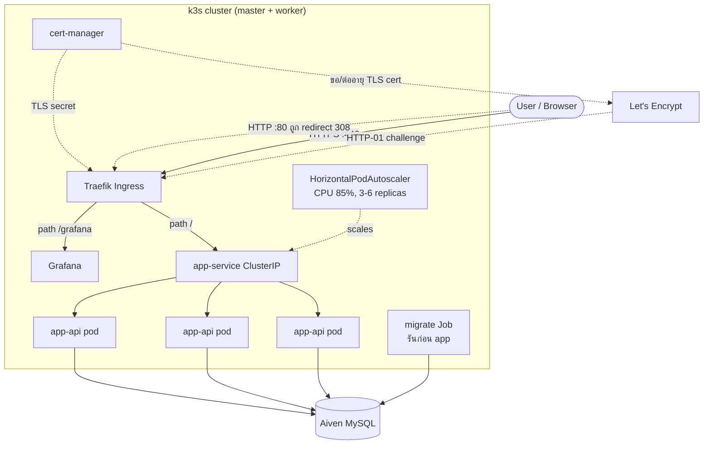
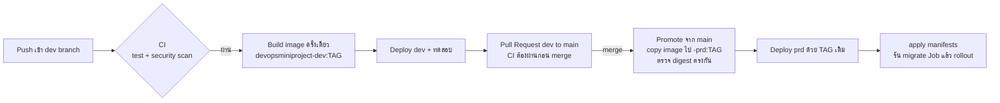

# DevOps Mini Project — Go API บน Kubernetes ที่ดูแลเอง

> โปรเจค DevOps แบบ end-to-end: นำ Go REST API มา containerize แล้ว deploy ขึ้น
> **k3s** Kubernetes cluster ที่ตั้งและดูแลเอง (provision ด้วย **Ansible**) รองรับหลาย environment พร้อม
> **CI/CD pipeline**, **security scanning**, **HTTPS อัตโนมัติ**, **monitoring**, **autoscaling**
> และ **image promotion** ที่ build ครั้งเดียวแล้วใช้ image ตัวเดิมจาก **dev → production**


🔗 **Live:** https://45.150.128.180.nip.io

> ใช้ Aiven MySQL free tier ซึ่งจะปิดตัวเองเมื่อไม่มีการใช้งาน หากเข้าไม่ได้แปลว่า
> database อยู่ในสถานะพัก

---

## ภาพรวม (Overview)

โปรเจคนี้สาธิต workflow การ deploy ที่ใกล้เคียงงานจริง สำหรับ web service ขนาดเล็ก —
ตั้งแต่ source code จนถึงแอปที่รันอยู่จริงผ่าน HTTPS มี monitoring และ auto-scale บน
infrastructure จริง (ไม่ใช่แค่ demo บนเครื่อง local)

Container image ตัวเดียวกันถูกใช้รัน 2 บทบาท โดยเลือกตอน runtime ผ่าน environment
variable:

- **`server`** — เปิดให้บริการ HTTP API
- **`migrator`** — รัน database migration ครั้งเดียวแล้วจบ (Kubernetes `Job`)

แยกออกเป็น 2 environment ที่อิสระจากกัน:

| Environment | Infrastructure | Database | เข้าถึง |
|---|---|---|---|
| **dev** | k3s บน VirtualBox VM (local) | Aiven MySQL (database `*_dev`) | HTTP ผ่าน IP ของ VM |
| **prd** | k3s บน VPS 2 เครื่อง (control-plane 1 + worker 1) | Aiven MySQL (database production) | HTTPS ผ่าน `45.150.128.180.nip.io` |

> dev ไม่มี TLS เพราะอยู่ใน IP ภายใน Let's Encrypt ยิงเข้ามาตรวจ (HTTP-01) ไม่ถึง

---

## สถาปัตยกรรม (Architecture)

### Runtime architecture (production)


```mermaid
flowchart TD
    User([User / Browser]) -->|HTTPS :443| Traefik[Traefik Ingress]
    User -.->|HTTP :80 ถูก redirect 308| Traefik
    LE[Let's Encrypt] -.HTTP-01 challenge.-> Traefik
    CM[cert-manager] -.ขอ/ต่ออายุ TLS cert.-> LE
    CM -.TLS secret.-> Traefik
    Traefik -->|path /| Svc[app-service ClusterIP]
    Traefik -->|path /grafana| Graf[Grafana]
    Svc --> P1[app-api pod]
    Svc --> P2[app-api pod]
    Svc --> P3[app-api pod]
    HPA[HorizontalPodAutoscaler<br/>CPU 85%, 3-6 replicas] -.scales.-> Svc
    P1 --> DB[(Aiven MySQL)]
    P2 --> DB
    P3 --> DB
    Job[migrate Job<br/>รันก่อน app] --> DB

    subgraph Cluster["k3s cluster (master + worker)"]
        Traefik
        CM
        Svc
        P1
        P2
        P3
        HPA
        Job
        Graf
    end
```

### CI/CD pipeline


```mermaid
flowchart LR
    Push[Push เข้า dev branch] --> CI{CI<br/>test + security scan}
    CI -->|ผ่าน| Build[Build image ครั้งเดียว<br/>devopsminiproject-dev:TAG]
    Build --> DevDeploy[Deploy dev + ทดสอบ]
    DevDeploy --> PR[Pull Request dev to main<br/>CI ต้องผ่านก่อน merge]
    PR -->|merge| Promote[Promote จาก main<br/>copy image ไป -prd:TAG<br/>ตรวจ digest ตรงกัน]
    Promote --> PrdDeploy[Deploy prd ด้วย TAG เดิม]
    PrdDeploy --> K8s[apply manifests<br/>รัน migrate Job แล้ว rollout]
```

---

## Tech Stack

| ส่วน | เครื่องมือ |
|---|---|
| **Language / Framework** | Go 1.26, Fiber v3, GORM |
| **Containerization** | Docker (multi-stage build บน alpine), GitHub Container Registry (GHCR) |
| **Orchestration** | Kubernetes (k3s), Traefik Ingress, Helm |
| **Infrastructure as Code** | Ansible (roles: common, k3s_server, k3s_agent) |
| **TLS** | cert-manager, Let's Encrypt (HTTP-01) |
| **Security** | Trivy (scan repo + image), Kubernetes securityContext (non-root, read-only filesystem) |
| **CI/CD** | GitHub Actions, self-hosted runners, GitHub Environments |
| **Monitoring / Alerting** | Prometheus, Grafana, Alertmanager (kube-prometheus-stack), แจ้งเตือนผ่าน Discord |
| **Testing** | Go testing (table-driven unit tests), k6 (load testing) |
| **Database** | MySQL (Aiven) |
| **Infrastructure** | VPS (production), VirtualBox (development) |

---

## ฟีเจอร์เด่น (Key Features)

- **Provision cluster ด้วย Ansible** — จาก Ubuntu เปล่าเป็น k3s cluster (master +
  worker) ในคำสั่งเดียว แบ่งเป็น 3 role: `common` (hostname, ปิด cloud-init network,
  ลบ search domain, firewall), `k3s_server` และ `k3s_agent` (worker ดึง token จาก
  master อัตโนมัติผ่าน `hostvars`) pin version ของ k3s ให้ตรงกับ prd, ซ่อน token
  ด้วย `no_log` และ **idempotent** (รันซ้ำได้ `changed=0`) ทดสอบบน VM โดยถอน k3s
  ออกแล้วสร้าง cluster ใหม่จาก playbook จากนั้นนำมาจัดการ **prd (VPS) จริง** โดยรัน
  `--check --diff` ก่อนเพื่อหา config drift แล้วค่อย apply ใช้ inventory แยกต่อ
  environment และเปิด/ปิด firewall ได้ด้วยตัวแปร (`manage_ufw`)
- **Server hardening** — firewall (ufw) แบบ deny เป็นค่าเริ่มต้น เปิดสาธารณะแค่
  22/80/443 และ SSH รับเฉพาะ key (ปิด password และ keyboard-interactive, root เข้าได้
  ด้วย key เท่านั้น) ตรวจ syntax ด้วย `sshd -t` ก่อนวางไฟล์ และยืนยันค่าที่ใช้จริงด้วย
  `sshd -T`
- **Image promotion (build once, deploy many)** — build image ครั้งเดียวบน dev แล้ว
  promote image ตัวเดิมไป prd ด้วย `docker buildx imagetools create` โดยไม่ build ใหม่
  workflow ตรวจว่า **digest ของ dev และ prd ตรงกัน** เพื่อยืนยันว่า prd รัน image
  ตัวเดียวกับที่ทดสอบแล้ว, promote ได้จาก `main` เท่านั้น (ต้องผ่าน PR + CI) และ
  ห้ามเขียนทับ tag ที่มีอยู่แล้วบน prd
- **Security scanning ใน CI (Trivy)** — สแกน repository (ช่องโหว่ของ dependency,
  secret ที่หลุดในโค้ด, misconfiguration ของ Dockerfile/Kubernetes manifest) และสแกน
  container image ที่ build จริง พบช่องโหว่ระดับ HIGH/CRITICAL ที่มีแพตช์แล้ว CI จะ fail
  และเป็น required check ก่อน merge เข้า `main`
- **Container hardening** — รันเป็น non-root user (UID 10001), root filesystem แบบ
  read-only, ตัด Linux capabilities ทั้งหมด, ปิด privilege escalation และใช้
  seccomp profile `RuntimeDefault`
- **Multi-stage Docker build** — แยก stage build ออกจาก runtime ทำให้ image เล็กลงมาก
  และฝัง build metadata (version, build time, commit SHA) ลงใน binary ผ่าน `-ldflags`
  แสดงผลที่ endpoint `/about`
- **Database migration เป็น Kubernetes Job** ที่รันจนเสร็จก่อนจะ rollout แอป โดยใช้
  image ตัวเดียวกันในโหมด `migrator`
- **แยก health probes ชัดเจน**:
  - `/livez` (liveness) — เช็คแค่ว่า process ยังทำงาน **ไม่แตะ DB** เพื่อไม่ให้
    DB หลุดชั่วคราวทำให้ pod ถูก restart โดยไม่จำเป็น
  - `/readyz` (readiness) — เช็ค database ด้วย เพื่อส่ง traffic เข้าเฉพาะ pod ที่
    พร้อมให้บริการจริง
- **HTTPS อัตโนมัติ** — cert-manager ขอและต่ออายุ certificate จาก Let's Encrypt
  ทดสอบกับ staging issuer ก่อนเปลี่ยนเป็น production เพื่อเลี่ยง rate limit
  และ redirect HTTP → HTTPS ทุก request ด้วย Traefik Middleware
- **Horizontal Pod Autoscaler** — scale `app-api` จาก 3 ถึง 6 replicas ที่ CPU
  85% (ทดสอบด้วย k6)
- **Unit tests แบบ table-driven** รันใน CI ก่อน merge ทุกครั้ง
- **การแยก config ตาม environment** — secret แยกผ่าน GitHub Environments,
  ConfigMap และ Ingress แยกไฟล์ต่อ environment
- **แยก platform กับ application** — ของที่ตั้งครั้งเดียวต่อ cluster (`k8s/platform/`)
  แยกจาก manifest ที่ deploy ทุก release
- **Monitoring stack** — Prometheus + Grafana ติดตั้งผ่าน Helm เปิดที่ `/grafana`
- **Alert เมื่อ certificate ใกล้หมดอายุ** — ให้ Prometheus เก็บ metrics ของ cert-manager
  ผ่าน ServiceMonitor แล้วเขียน `PrometheusRule` 2 ตัว: เตือนเมื่อ cert เหลือน้อยกว่า
  14 วัน (cert-manager ต่ออายุตอนเหลือ 30 วัน alert จึงดังเฉพาะเมื่อการต่ออายุล้มเหลว
  ต่อเนื่อง) และเมื่อ cert ไม่ Ready นาน 15 นาที Alertmanager ส่งเข้า Discord เฉพาะ
  alert เรื่อง cert (กัน alert ของ component ที่ k3s ไม่ได้แยก process ออกมา) และแจ้ง
  ตอนปัญหาหายด้วย ทดสอบทั้งเส้นโดยลดเงื่อนไขชั่วคราวให้ alert ดังจริง webhook URL
  เก็บแยกในไฟล์ values ที่ไม่ commit

---

## CI/CD และ Branching Strategy

โปรเจคใช้ flow **dev → main** พร้อม branch protection:

1. งานทั้งหมดทำบน branch **`dev`**
2. ทุกครั้งที่ push/PR **CI workflow** จะรันอัตโนมัติ 2 job:
   - `test` — ตรวจ `go mod tidy` → `go vet` → `go build` → `go test`
   - `security` — Trivy สแกน repository และ container image
3. **Build image ครั้งเดียว** เป็น `devopsminiproject-dev:<tag>` แล้ว deploy ขึ้น
   **dev** เพื่อทดสอบบน cluster จริง
4. **Pull Request** จาก `dev` เข้า `main` ต้องให้ `test` และ `security` ผ่านก่อน
   ถึง merge ได้ (บังคับด้วย branch ruleset บน `main`)
5. **Promote** image tag เดิมจาก `-dev` ไป `-prd` (รันจาก `main` เท่านั้น) โดยไม่
   build ใหม่ และตรวจว่า digest ตรงกัน
6. **Deploy ขึ้น production แบบ manual** ด้วย tag เดิม (คุมจังหวะการ release เอง)

| Workflow | Trigger | หน้าที่ |
|---|---|---|
| `ci.yaml` | push / PR | test (tidy, vet, build, test) และ security (Trivy scan) |
| `workflow.yaml` | manual | build image **dev** แล้ว push เข้า GHCR (Docker Buildx) ใช้ tag แบบ calendar versioning |
| `promote.yaml` | manual | promote image จาก dev ไป prd โดยไม่ build ใหม่ และตรวจ digest |
| `workflow-deploy.yaml` | manual | deploy ขึ้น dev หรือ prd (self-hosted runner แยก label ต่อ environment) |

> ใช้ 2 package ใน GHCR (`devopsminiproject-dev` และ `devopsminiproject-prd`) แทน
> registry แยกต่อ environment ใน `-prd` จึงมีเฉพาะ image ที่ผ่านการทดสอบบน dev และ
> ผ่าน PR มาแล้วเท่านั้น

> ตอนนี้เป็น **Continuous Delivery** — pipeline พร้อม deploy ตลอด แต่ขั้นขึ้น
> production ตั้งใจให้เป็น manual เพื่อคุมจังหวะการ release ส่วน CI gate
> ทำหน้าที่ปกป้อง branch `main`

---

## โครงสร้างโปรเจค (Repository Structure)

```
.
├── cmd/                      # Entrypoint ของแอป (โหมด server / migrator)
├── di/                       # Dependency injection: config, database, server
├── service/                  # HTTP handlers (user CRUD, status, health) + unit tests
├── repository/               # Data access layer (GORM)
├── entity/                   # Domain models
├── util/                     # Build info, helpers + unit tests
├── k8s/
│   ├── platform/             # ตั้งครั้งเดียวต่อ cluster (ไม่ได้ deploy ทุก release)
│   │   ├── cluster-issuer.yaml       # Let's Encrypt staging + production
│   │   ├── cert-manager-values.yaml  # ค่าของ cert-manager (เปิด ServiceMonitor)
│   │   ├── cert-alerts.yaml          # PrometheusRule: cert ใกล้หมดอายุ / ไม่ Ready
│   │   └── monitoring-values.yaml    # ค่าของ kube-prometheus-stack + Alertmanager route
│   ├── namespace.yaml
│   ├── configmap-dev.yaml / configmap-prd.yaml
│   ├── app.yaml              # Deployment + Service
│   ├── job.yaml              # DB migration Job
│   ├── hpa.yaml              # HorizontalPodAutoscaler
│   ├── ingress-dev.yaml      # HTTP
│   └── ingress-prd.yaml      # HTTPS + cert-manager + redirect middleware
├── ansible/                  # Provision k3s cluster (IaC)
│   ├── inventory.ini         # VM ทดสอบ (master / workers + k3s_version)
│   ├── inventory-prd.ini     # VPS production
│   ├── site.yaml             # playbook หลัก: common → k3s_server → k3s_agent
│   └── roles/
│       ├── common/           # hostname, cloud-init, netplan, ufw, SSH hardening
│       ├── k3s_server/       # ติดตั้ง server, อ่าน token, ตั้ง kubeconfig
│       └── k3s_agent/        # ติดตั้ง agent แล้ว join master
├── .github/workflows/        # CI + security scan, build, promote, deploy pipelines
└── Dockerfile                # Multi-stage build
```

---

## API Endpoints

| Method | Path | คำอธิบาย |
|---|---|---|
| `GET` | `/` | ภาพรวมสถานะ runtime |
| `GET` | `/about` | ข้อมูล service (version, build time, commit) |
| `GET` | `/livez` | Liveness probe (เช็คแค่ process) |
| `GET` | `/readyz` | Readiness probe (เช็ค DB) |
| `GET` | `/user` | ดูรายชื่อ user ทั้งหมด |
| `POST` | `/user` | สร้าง user |
| `DELETE` | `/user` | ลบ user |

---

## Monitoring และ Autoscaling

- **Grafana dashboards** (จาก kube-prometheus-stack) ติดตาม CPU/memory ราย pod,
  ราย namespace และราย node
- **Alerting** — แจ้งเตือนเข้า Discord เมื่อ TLS certificate ใกล้หมดอายุหรือไม่ Ready
- **Load testing ด้วย k6** ยิง traffic เข้า API เพื่อยืนยันว่า HPA scale replicas
  ขึ้นเมื่อ CPU สูงต่อเนื่อง และ scale ลงหลังพ้น stabilization window

<!-- ย้ายไฟล์ image.png เดิมมาไว้ที่ docs/ แล้วตั้งชื่อให้ตรงกับด้านล่าง -->


---

## การตั้ง cluster ใหม่ (Platform Setup)

ขั้นตอนที่ทำครั้งเดียวต่อ cluster ก่อน deploy แอปผ่าน workflow ครั้งแรก:

1. เตรียมเครื่อง Ubuntu 24.04 ที่มี **IP คงที่** และ SSH ด้วย key ได้ แล้วใส่ใน
   `ansible/inventory.ini`
2. สร้าง cluster ด้วย Ansible (hostname, network, firewall, k3s server + agent):
   ```bash
   cd ansible
   ansible-playbook site.yaml -K
   ```
3. ติดตั้ง self-hosted runner บน node ที่มี kubeconfig และตั้ง label ตาม environment
4. ติดตั้ง monitoring — สร้างไฟล์ `alertmanager-discord-values.yaml` (ไม่ commit,
   อยู่ใน `.gitignore`) ที่มี `alertmanager.config.receivers` พร้อม Discord webhook URL
   แล้วรัน:
   ```bash
   helm upgrade --install monitoring prometheus-community/kube-prometheus-stack \
     -n monitoring --create-namespace \
     -f k8s/platform/monitoring-values.yaml -f alertmanager-discord-values.yaml
   ```
5. ติดตั้ง cert-manager (เฉพาะ prd):
   ```bash
   helm upgrade --install cert-manager jetstack/cert-manager -n cert-manager \
     --create-namespace -f k8s/platform/cert-manager-values.yaml
   ```
6. `kubectl apply -f k8s/platform/cluster-issuer.yaml -f k8s/platform/cert-alerts.yaml`
7. ถ้าผู้ให้บริการมี firewall ภายนอก ให้เปิด port 22, 80 และ 443 (firewall ของ OS
   จัดการโดย Ansible แล้ว — เปิดสาธารณะแค่ 3 port นี้ และให้ node คุยกันได้ทุก port)

> cluster prd ถูกตั้งด้วยมือก่อนมี playbook ขั้นตอนที่ทำมือและปัญหาที่เจอ
> (hostname ซ้ำ, search domain, kubeconfig) ถูกนำมาเขียนเป็น playbook ทดสอบบน VM
> แล้วนำมาใช้กับ prd ด้วย `ansible-playbook -i inventory-prd.ini site.yaml --check --diff`
> ก่อน apply จริง ปัจจุบัน prd ถูกจัดการด้วย playbook ชุดเดียวกัน (รันซ้ำได้ `changed=0`)

---

## ปัญหาที่เจอและวิธีแก้ (Challenges & Solutions)

ตัวอย่างปัญหาจริงที่แก้ระหว่างทำโปรเจค:

- **Search domain + `ndots:5` ทำให้ต่อ database ผิดที่** — migration Job timeout
  ทั้งที่ `dig` จาก host ได้ IP ถูกต้อง ใช้ `getent` ใน pod (ซึ่งใช้ search list
  เหมือนแอป) พบว่า node มี search domain `com` จาก netplan ของผู้ให้บริการ VPS
  ทำให้ชื่อถูกขยายเป็น `*.aivencloud.com.com` แล้วไปชน wildcard DNS ของ domain อื่น
  แก้ที่ node และตั้ง `dnsConfig.ndots` ใน pod spec เป็นชั้นป้องกันเพิ่ม
- **Panic จาก `time.LoadLocation` หลังเปลี่ยน image เป็น alpine** — alpine ไม่มี
  tzdata และโค้ดทิ้ง error ไว้ ทำให้ pod ตายเมื่อมีคนเปิดหน้าแรก แต่ probe ยังผ่าน
  unit test ไม่จับเพราะ CI runner มี tzdata แก้โดยฝัง `time/tzdata` ลงใน binary
  และเพิ่ม fallback เมื่อโหลด timezone ไม่ได้
- **`Connection refused` กับ `timed out`** — ใช้ความต่างนี้วิเคราะห์ว่า kubelet
  ไม่ได้ listen (ไม่ใช่ปัญหา firewall) เมื่อ pod บน worker ค้าง
- **Worker node join ไม่ได้ (`Node password rejected`)** — เกิดจาก hostname ซ้ำและ
  node-password ไม่ตรงกัน แก้โดยล้าง credential **ทั้ง 2 ฝั่ง** ทั้งที่ server
  (secret) และ agent (`/etc/rancher/node/password`)
- **`kubectl apply` ไม่ลบ resource เก่า** — ไฟล์ ingress ว่างทำให้ deploy fail
  แต่เว็บยังเข้าได้เพราะ ingress ตัวเดิมค้างอยู่ใน cluster (config drift) ตรวจผล
  ของ workflow แทนการดูแค่ว่าเว็บยังเข้าได้
- **Certificate ค้างสถานะ `processing`** — 2 certificate ขอ domain เดียวกันพร้อมกัน
  ตัวที่สองใช้ authorization ซ้ำแล้ว order ไม่เดินต่อ แก้โดยให้ cert-manager
  สร้าง request ใหม่
- **Redirect HTTP → HTTPS กับการต่ออายุ certificate** — HTTP-01 challenge
  ของ Let's Encrypt ใช้ port 80 และ redirect ครอบคลุม path `/.well-known/acme-challenge/`
  ด้วย จึงอาจทำให้ต่ออายุ cert ไม่ผ่าน แทนที่จะรอลุ้นตอน cert ใกล้หมดอายุ
  ทดสอบโดยสลับไป staging issuer เพื่อบังคับให้ออก cert ใหม่จริง ผลคือผ่านปกติ
  (Let's Encrypt ตาม redirect ได้) แล้วค่อยสลับกลับเป็น production
- **การออกแบบ liveness/readiness** — แยก probe เพื่อให้ DB หลุดชั่วคราวกระทบแค่
  readiness (หยุดรับ traffic) แทนที่จะ kill pod ที่ยังดีอยู่
- **Managed database ปิดตัวเอง** — Aiven free tier ปิด service เมื่อไม่มีการใช้งาน
  ทำให้ระบบที่เคยทำงานได้พังโดยไม่ได้แก้โค้ด ควรเช็คสถานะ dependency ก่อนไล่ network
- **`unknown blob` ตอน push เข้า GHCR** — เปลี่ยน build step จาก `docker push` CLI
  แบบเดิม มาเป็น **Docker Buildx (`build-push-action`)**
- **Promote แล้ว digest ไม่ตรงกัน** — step ตรวจ digest จับได้ว่า image บน prd
  ไม่ใช่ตัวเดียวกับ dev สาเหตุคือ `imagetools create` ห่อ manifest เดิมไว้ใน
  image index ใหม่เป็นค่าเริ่มต้น ข้างในยังเป็น image ตัวเดิม แต่ digest ของชั้นนอก
  เปลี่ยน แก้ด้วย `--prefer-index=false` ให้ copy manifest ตรงตัว ผลคือ digest ตรงกัน
- **Trivy เจอช่องโหว่ใน binary ทั้งที่ repo สะอาด** — ผลสแกน repository เป็น 0
  แต่สแกน image ยังเจอช่องโหว่ใน Go standard library ที่ถูก compile ลงใน binary
  เพราะ Go ใน builder image ของ Dockerfile เป็นเวอร์ชันเก่า แก้โดยอัปเกรด dependency
  และ pin builder image เป็น Go เวอร์ชันที่มีแพตช์แล้ว (ต้องสแกนทั้ง source และ
  artifact ที่ build จริง)
- **`curl | sh` รายงานว่าสำเร็จทั้งที่ไม่ได้ติดตั้งอะไร** — ตอนทดสอบสร้าง cluster
  ใหม่จาก playbook, `get.k3s.io` ตอบ HTTP 500 แต่ exit code ของ pipe มาจาก `sh`
  (ได้ input ว่างจึงจบด้วย 0) Ansible จึงขึ้น `changed` แล้วไปค้างรอไฟล์ token จน
  timeout แก้โดยดาวน์โหลดสคริปต์ติดตั้งที่ pin ตาม version ด้วย `get_url` (fail จริง
  เมื่อ HTTP error) แล้วรันด้วย `command` แทน `shell` — บั๊กนี้เจอเพราะทดสอบติดตั้ง
  ใหม่ตั้งแต่ศูนย์ ไม่ใช่แค่รันซ้ำบนเครื่องที่ติดตั้งแล้ว
- **IP จาก DHCP เปลี่ยนหลังปิดเครื่อง** — k3s ผูก IP ของ master ไว้ใน config ของ
  worker และใน certificate ถ้า IP เปลี่ยนหลังติดตั้ง cluster จะพัง จึงตั้ง static IP
  ก่อนติดตั้ง k3s (VPS ไม่มีปัญหานี้เพราะได้ IP ถาวร)
- **บั๊กเงียบใน playbook** — `hosts: worker` ไม่ตรงกับกลุ่ม `workers` ทำให้ play ถูก
  ข้าม (`no hosts matched`) โดยไม่มี error และ `no_log` ที่วางผิดระดับกลายเป็นตัวแปร
  ธรรมดาแทนการซ่อน secret — ต้องอ่าน output ทุก play ไม่ใช่ดูแค่ว่ามี failed ไหม
- **Config drift บน prd ที่ Ansible ตรวจเจอ** — `--check --diff` พบว่า `/etc/hosts`
  ของ worker ยังชี้ชื่อ `ubuntu` (ชื่อของ master) มาที่ตัวเอง ทั้งที่เปลี่ยน hostname
  ไปนานแล้ว สาเหตุคือ user-data ของผู้ให้บริการ VPS ตั้ง `manage_etc_hosts: true`
  ทำให้ cloud-init เขียน `/etc/hosts` ใหม่ทุกครั้งที่ boot ด้วยชื่อจาก metadata
  (สองระบบจัดการไฟล์เดียวกัน) ค่านี้อยู่ใน user-data จึงเขียนทับด้วย `cloud.cfg.d`
  ไม่ได้ แก้โดยปิด cloud-init หลังเครื่องถูกสร้างแล้ว ให้ Ansible เป็นผู้จัดการ
  เพียงคนเดียว และยืนยันด้วยการ drain → reboot → uncordon worker
- **Port ภายในของ cluster เปิดสู่อินเทอร์เน็ต** — ตรวจจากภายนอกด้วย `nc` พบว่า
  6443 (Kubernetes API), 10250 (kubelet) และ 9100 (node-exporter ที่ไม่ต้องยืนยันตัวตน)
  เข้าได้จากทุกที่ เพราะ ufw บน VPS ไม่เคยถูกเปิดและผู้ให้บริการไม่มี firewall ให้
  การเปิด ufw ด้วยกฎแบบไล่ port เสี่ยงบล็อก component ที่ไม่ได้นึกถึง จึงออกแบบใหม่เป็น
  deny เป็นค่าเริ่มต้น, เปิดสาธารณะแค่ 22/80/443 และอนุญาตทุก port ระหว่าง node
  (ดึง IP จาก inventory ด้วย `map('extract', hostvars, 'ansible_host')`) ทดสอบบน VM
  ก่อน แล้ว rollout บน prd ด้วย `--check --diff` โดยเปิด Console ของผู้ให้บริการและ
  SSH session สำรองไว้ จากนั้นยืนยันว่า SSH ใหม่, เว็บ, node, pod และ monitoring
  ยังทำงาน และ port ภายในเข้าจากข้างนอกไม่ได้แล้ว — ระหว่างเตรียมการใช้ตัวแปร
  `manage_ufw` ข้าม firewall บน prd ไว้ก่อน (ต้องใช้ `| bool` เพราะค่าจาก inventory
  แบบ ini เป็น string และ `"false"` ถือเป็นจริง)
- **ปิด SSH password โดยไม่ล็อกตัวเองออก** — ค่าที่ตั้งใน `sshd_config` อาจไม่มีผล
  เพราะ cloud image มี `sshd_config.d/50-cloud-init.conf` ที่เปิด password ไว้ และ sshd
  ใช้ค่าที่เจอก่อน จึงวาง config เป็น `00-hardening.conf` ให้ถูกอ่านก่อน ส่วน
  `PermitRootLogin no` จะตัด Ansible ออกจาก prd (เชื่อมต่อด้วย root) จึงใช้
  `prohibit-password` แทน ก่อน rollout ทดสอบ login ด้วย key แบบบังคับปิด password
  ทุกเครื่อง และหลัง rollout ยืนยันว่า login ด้วย password ถูกปฏิเสธ
  (`Permission denied (publickey)`)
- **Config ถูกตาม doc ของ Alertmanager แต่ operator ไม่ยอมรับ** — ใช้
  `webhook_url_file` เพื่ออ่าน Discord URL จาก Secret แต่หลัง `helm upgrade` pod ของ
  Alertmanager ไม่ถูกสร้างใหม่ ไล่จาก resource → StatefulSet → pod แล้วดู
  `status.conditions` (`ReconciliationFailed`) กับ log ของ Prometheus Operator พบว่า
  operator v0.91 ไม่รู้จัก field นี้จึงไม่ apply config เลย (pod เดิมยังทำงานด้วย config
  เก่า ไม่มี downtime) แก้โดยใช้ `webhook_url` และแยก receivers ที่มี URL ไว้ในไฟล์
  values อีกไฟล์ที่ไม่ commit แล้วส่งให้ Helm ด้วย `-f` 2 ไฟล์
- **ServiceMonitor/PrometheusRule ที่ Prometheus มองไม่เห็น** — kube-prometheus-stack
  เลือกเฉพาะ resource ที่มี label `release: <ชื่อ release>` ถ้าไม่ใส่จะไม่มี error
  แต่ไม่มี metrics/rule จึงใส่ label นี้ทั้งใน values ของ cert-manager และใน
  PrometheusRule แล้วยืนยันใน Grafana ว่า metric และ rule ถูกโหลดจริง

---

## สิ่งที่จะพัฒนาต่อ (Future Improvements)

- [ ] **ใช้ user ปกติ + sudo แทน root บน prd** แล้วปิด root login (`PermitRootLogin no`)
- [ ] **ตรวจ drift อัตโนมัติ** — รัน `--check --diff` กับ prd ตามรอบเวลาแล้วแจ้งเตือนเมื่อมี `changed`
- [ ] **ติดตั้ง Helm charts และ runner ด้วย Ansible** (monitoring, cert-manager, ClusterIssuer, alert rules) เก็บ webhook URL ด้วย Ansible Vault
- [ ] **Pin GitHub Actions ด้วย commit SHA** และให้ Dependabot อัปเดตให้อัตโนมัติ
- [ ] **Approval gate ก่อน promote/deploy prd** ด้วย required reviewers ของ GitHub Environments
- [ ] **Smoke test ใน CI** — รัน container จริงแล้วเรียก endpoint ก่อน deploy
- [ ] **Validate manifest ใน CI** (kubeconform)
- [ ] **Application-level metrics** เปิดที่ `/metrics` ให้ Prometheus เก็บ
- [ ] **Custom domain** แทน nip.io

---

## ผู้จัดทำ (Author)

- **Name:** Thanut Sukprasertsom
- **Email:** thanutsukprasertsomm@hotmail.com
- **GitHub:** https://github.com/thanutgit
- **LinkedIn:** https://www.linkedin.com/in/thanut-sukprasertsom-b77048386/